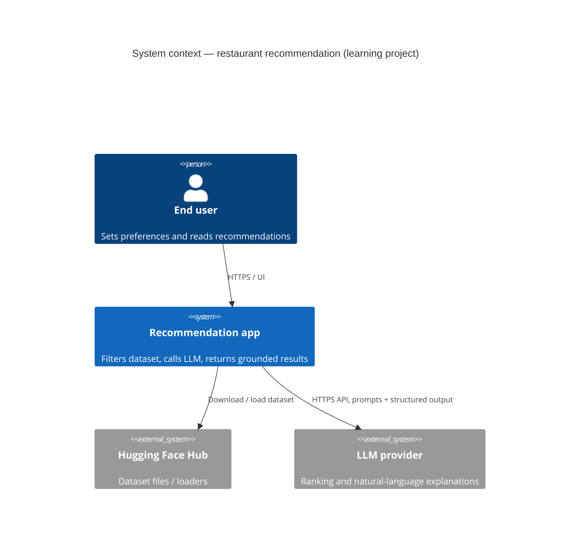
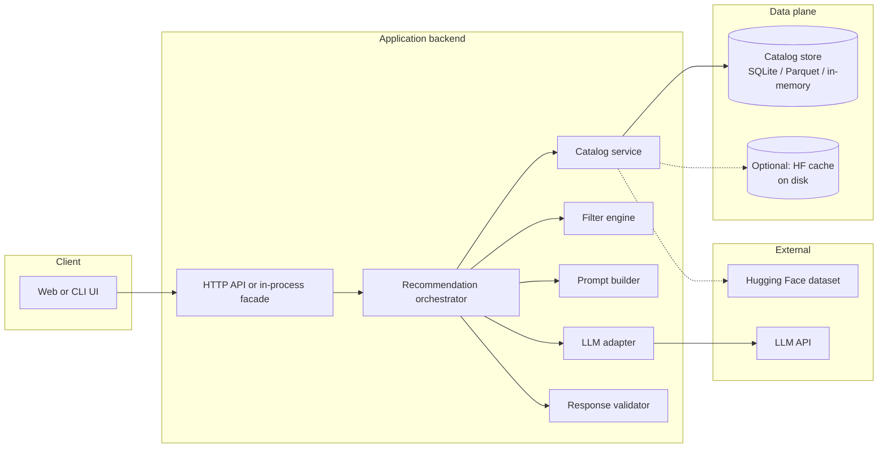
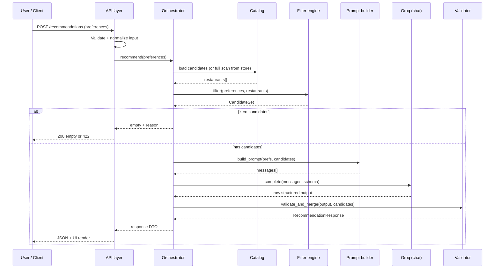

# System architecture

This document describes the **target architecture** for the AI-assisted restaurant discovery system defined in [problemStatement.md](./problemStatement.md). It is written so implementation can proceed in any reasonable stack; where the problem statement leaves choices open, this document spells out **interfaces and responsibilities** rather than locking a single vendor or framework.

---

## 1. Goals and architectural principles

| Principle | Implication for design |
|-----------|-------------------------|
| **Grounding** | Every surfaced restaurant must be traceable to a row (or stable ID) in the ingested dataset. The LLM never invents venues. |
| **Hard vs. soft constraints** | Location, budget, minimum rating, and required cuisines are enforced **before** the LLM (deterministic filter). Softer intent lives in the prompt. |
| **Separation of concerns** | Ingestion, catalog access, filtering, prompt construction, LLM I/O, and presentation are distinct modules with clear contracts. |
| **Observability** | Log filter counts, prompt token estimates, latency, and model errors without logging secrets or full prompts in production unless redacted. |
| **Testability** | Filtering and schema mapping are unit-testable with fixtures; LLM calls are mockable behind an adapter interface. |

---

## 2. Context (who interacts with what)



**Boundaries** (from problem statement): no Zomato production APIs, payments, or order lifecycle. The app is a **read-only** experience over a **local or cached** snapshot of the public dataset.

---

## 3. Logical containers (major deployable or process boundaries)

These are **logical** containers; a small learning project might collapse several into one process (e.g., monolith + embedded DB file).



| Container | Responsibility |
|-----------|----------------|
| **Client** | Collects structured + optional free-text preferences; renders ranked list with explanations. |
| **API** | Validates input, maps HTTP/JSON to domain DTOs, returns errors with stable codes. |
| **Recommendation orchestrator** | Single use-case entry: load preferences → resolve catalog → filter → build prompt → call LLM → validate → map to API response. |
| **Catalog service** | Abstraction over dataset: schema mapping, load-on-start or lazy load, stable `restaurant_id`, query by filters where supported. |
| **Filter engine** | Pure function over `Restaurant` + `UserPreferences` → ordered or unordered candidate list; deterministic. |
| **Prompt builder** | Serializes user intent + candidate JSON/markdown; embeds guardrail instructions. |
| **LLM adapter** | Provider-specific HTTP/SDK; timeouts, retries (bounded), temperature policy; parses structured model output. |
| **Response validator** | Ensures every returned ID exists in the candidate set; drops or re-orders invalid rows; optional repair pass (see §7). |
| **Catalog store** | Persisted or in-memory representation after ingestion; supports fast read for filter path. |

---

## 4. Component-level design

### 4.1 Ingestion pipeline

**Trigger**: Application startup, CLI command, or scheduled job (for learning projects, startup or one-off script is enough).

**Steps**:

1. **Fetch or open** the dataset ([ManikaSaini/zomato-restaurant-recommendation](https://huggingface.co/datasets/ManikaSaini/zomato-restaurant-recommendation)) via Hugging Face `datasets` or cached files.
2. **Schema discovery** — Read actual column names; map to an internal **canonical schema** (see §5) via a configurable mapping table (YAML/JSON) so column renames on the Hub do not break code.
3. **Normalize** — Trim strings, parse numerics, split multi-value cuisine strings, unify city/location spelling where trivial.
4. **Assign `restaurant_id`** — Stable surrogate key (hash of key columns or row index after deterministic sort) stored in the catalog store.
5. **Index** — Optional: indexes on `city`, `rating`, `cost` for faster filtering at scale.

**Outputs**: Populated catalog store + ingestion metrics (row count, dropped rows, warnings).

### 4.2 Catalog service

- **Read API** (internal): `get_restaurant_by_id(id)`, `stream_all()` or `query(filters)` depending on store.
- **No business rules** about “what user wants” here — only data access and mapping from raw → canonical model.

### 4.3 Filter engine

**Inputs**: `UserPreferences`, `Iterator[Restaurant]` or in-memory collection.

**Hard filters** (all must be satisfied if the field exists on the restaurant and the user specified a constraint):

- Location: substring match, normalized city token, or explicit allowlist mapping user input → dataset location values.
- Minimum rating: `restaurant.rating >= user.min_rating` (null-safe: define whether null ratings are excluded).
- Cuisine: any-of match against restaurant cuisine tags (case-insensitive).
- Budget: map user band to numeric range using configurable percentiles **computed at ingest time** or fixed thresholds documented in config (addresses open decision in problem statement).

**Soft matching** (optional pre-ranking before LLM):

- Weighted score: higher rating, closer cost to preferred midpoint, cuisine overlap count.
- Cap **candidate count** (e.g., 30–80) before LLM to control tokens and latency; if over cap, take top-N by heuristic score or random stratified sample (document choice).

**Output**: `CandidateSet` — list of `Restaurant` records + metadata (`total_after_hard_filters`, `capped_to`).

### 4.4 Prompt builder

**Responsibilities**:

- Inject **system** instructions: only restaurants from the provided list; do not invent attributes; output **machine-parseable** structure (JSON schema or strict key-value blocks).
- Inject **user** message: preferences summary + serialized candidates (compact JSON or markdown table).
- Request **structured output**: ordered list of `{ "restaurant_id", "rank", "explanation" }` and optional `summary` string.

**Token management**: Truncate long text fields per restaurant; prefer IDs over names for joining back post-LLM.

### 4.5 LLM adapter (Groq)

- **Provider**: **[Groq](https://console.groq.com/)** exposes an **OpenAI-compatible** Chat Completions API (same message shape as OpenAI’s `chat.completions`). The service URL is typically `https://api.groq.com/openai/v1` with `POST /chat/completions`.
- **Configuration**: `GROQ_API_KEY` (and optionally `GROQ_BASE_URL`, `GROQ_MODEL`) from environment; defaults for model/timeout/retries can be duplicated or overridden in `config/app.toml` under `[groq]`. Read timeout on the order of 30–60s.
- **Retries**: Idempotent-safe retries on 429/5xx with exponential backoff and max attempts.
- **Parsing**: Strict JSON parse of assistant `content`; on failure, return structured error to orchestrator (no silent fallback to ungrounded prose for primary UX). Strip optional ` ```json ` fences if the model wraps the payload.

### 4.6 Response validator and assembler

1. Parse LLM output into `RankedPick[]`.
2. **Join** each `restaurant_id` to the in-memory map from the candidate batch.
3. **Reject** unknown IDs; optionally **re-fetch** only known picks and sort by `rank`.
4. If the validated list is shorter than the requested top-K, optionally **deterministic backfill**: append next-best from heuristic pre-rank with a templated explanation (“Listed for high rating in your area”) — only if product policy allows non-LLM explanations; otherwise return fewer items with a warning flag.

**API response** merges **ground truth** fields from `Restaurant` (name, cuisines, rating, cost) with LLM `explanation` so the UI never trusts the model for numeric facts.

### 4.7 Client / presentation

- **Forms** for structured fields; optional textarea for soft preferences.
- **Results**: card per restaurant showing grounded fields + explanation; optional one-line summary at top.
- **Empty state**: when hard filters yield zero rows, show message before LLM call; do not call LLM.

---

## 5. Canonical data model (conceptual)

These are **internal** types; names can vary by language.

**Restaurant (canonical)**

| Field | Type | Notes |
|-------|------|--------|
| `restaurant_id` | string | Stable surrogate. |
| `name` | string | Display name. |
| `city` / `location` | string | Align to problem statement “location”. |
| `cuisines` | string[] | Normalized tokens. |
| `aggregate_rating` | float \| null | Map from dataset. |
| `cost_for_two` or `approx_cost` | number \| null | Budget mapping target. |
| `raw` | map | Optional: preserve unmapped columns for richer prompts later. |

**UserPreferences**

| Field | Type | Notes |
|-------|------|--------|
| `location` | string | Required for MVP if dataset is city-centric. |
| `budget_band` | enum or range | Maps via config. |
| `cuisines` | string[] | Optional; empty means any. |
| `min_rating` | float | Default e.g. 0 or 3.0. |
| `free_text` | string? | Soft preferences. |
| `top_k` | int | Default 5–10. |

**RecommendationResponse**

| Field | Type | Notes |
|-------|------|--------|
| `summary` | string? | From LLM if enabled. |
| `items` | array | Each: grounded `Restaurant` subset + `explanation` + `rank`. |
| `debug` | object? | Optional: filter counts, model id — off in production UI. |

---

## 6. End-to-end sequence: recommend



---

## 7. Grounding, safety, and quality guardrails

| Risk | Mitigation |
|------|------------|
| Hallucinated restaurants | Validator drops unknown IDs; primary display fields sourced from catalog only. |
| Hallucinated numbers | Never display model-proposed ratings/costs; only catalog values. |
| Prompt injection in `free_text` | Treat as untrusted text; instruct model to ignore instructions inside user content that conflict with system rules; optionally strip delimiters or cap length. |
| Oversized prompts | Candidate cap + per-field truncation; log token estimate. |
| Non-JSON model output | Parse retry with “fix to valid JSON only” once; then fail gracefully with error code. |
| Latency | Async request handling in web servers; optional loading indicator; timeout with user-readable message. |

**Optional second pass** (complexity trade-off): If validator finds invalid IDs, send a **small repair prompt** containing only valid IDs and ask model to correct the list (bounded to one retry).

---

## 8. Configuration and secrets

| Concern | Approach |
|---------|----------|
| HF dataset id / revision | Version pin (revision hash) in config for reproducibility per success criteria. |
| Column mapping | `config/mapping.yaml` (example path) — maps Hub columns → canonical fields. |
| Budget bands | Configurable thresholds or percentile keys from ingest statistics. |
| LLM (Groq) | `GROQ_API_KEY` in environment (transitional: `LLM_API_KEY` may be read if `GROQ_API_KEY` is unset); never commit. `GROQ_BASE_URL` (default Groq OpenAI-compatible base), `GROQ_MODEL`, and optional `[groq]` table in `config/app.toml` for defaults. |

---

## 9. Observability and operations

- **Metrics**: `ingestion_rows`, `filter_pass_count`, `candidates_sent_to_llm`, `llm_latency_ms`, `llm_errors`, `validation_drops`.
- **Logging**: Structured logs; redact API keys; truncate prompts in non-dev environments.
- **Tracing** (optional): OpenTelemetry span around orchestrator and LLM call for learning exercises in distributed tracing.

---

## 10. Deployment views (options)

| Profile | Description |
|---------|-------------|
| **Local dev** | Single process, in-memory catalog after load, `.env` for LLM key. |
| **Notebook / script** | Orchestrator logic invoked in cells for experimentation; same modules as app. |
| **Container** | One image: app + optional SQLite volume; HF cache volume for faster restarts. |
| **Split** (future) | API service + static frontend; catalog rebuilt in CI or on deploy from pinned dataset revision. |

No requirement for Kubernetes at learning-project scale; keep paths simple until traffic demands.

---

## 11. Testing strategy (architecture-level)

| Layer | What to test |
|-------|----------------|
| Schema mapping | Golden-file tests: sample raw row → canonical `Restaurant`. |
| Filter engine | Parametric tests: location, rating, cuisine, budget edge cases (nulls, boundaries). |
| Prompt builder | Snapshot of prompt shape (redacted); ensures all candidate IDs appear once. |
| Validator | Mangles LLM JSON (bad id, duplicate id, wrong order) → correct merge behavior. |
| LLM adapter | Mock HTTP; verifies headers, timeout, retry on 429. |
| E2E | Smoke test with recorded fixture response (no live LLM in CI) optional. |

---

## 12. Evolution path (out of scope today, aligned with problem statement)

- **Embeddings + vector retrieval** for soft “vibes” or long free-text before LLM.
- **Learned ranker** trained on click or rating logs (not available in current scope).
- **A/B** prompt variants evaluated offline on persona sets.

---

## 13. Document map

| Document | Role |
|----------|------|
| [problemStatement.md](./problemStatement.md) | Why and what success means. |
| **architecture.md** (this file) | How subsystems fit together and communicate. |
| *Future: ADR folder or `docs/decisions/*`* | Record stack choices as open decisions close. |

---

*Update this architecture when stack choices (language, framework, DB) are made: add a concrete deployment diagram and replace generic container names with actual service names.*
