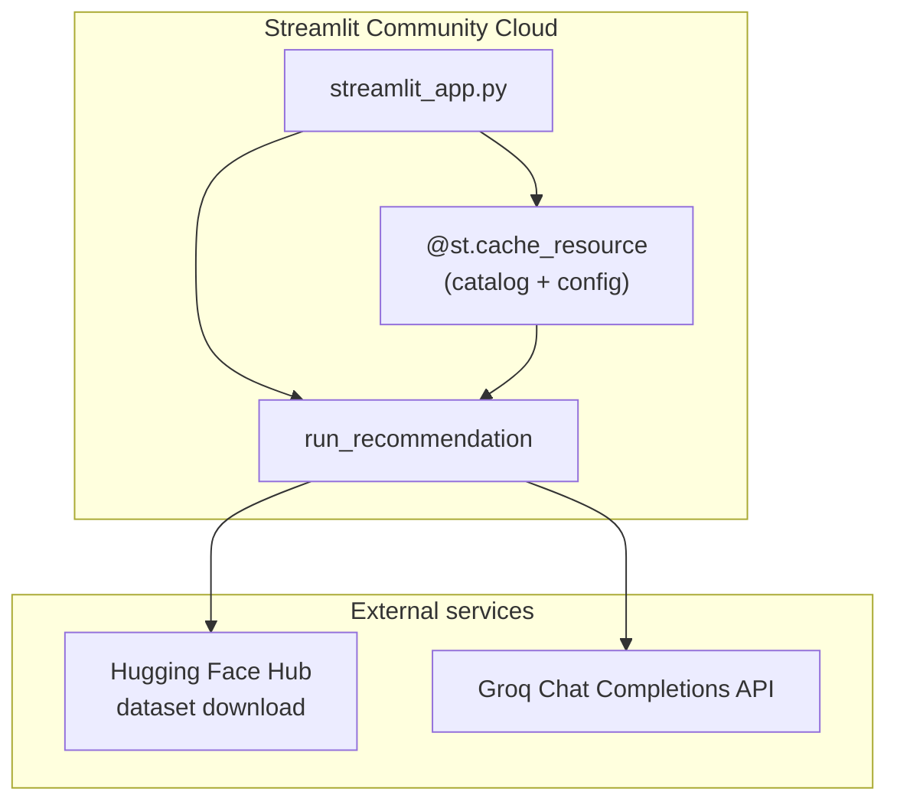

# Deployment plan — Streamlit (Streamlit Community Cloud)

This document describes how to deploy **zomato-recsys** on [Streamlit Community Cloud](https://streamlit.io/cloud). The app is a **single-process** Python UI that reuses the existing recommendation pipeline (`run_recommendation`, filters, Groq adapter). The current **FastAPI + static HTML** stack remains useful for local API testing; production on Streamlit replaces that presentation layer.

**Related docs:** [architecture.md](./architecture.md), [implementation-plan.md](./implementation-plan.md), [problemStatement.md](./problemStatement.md).

---

## 1. Deployment goals

| Goal | Approach |
|------|----------|
| Public demo without running `uvicorn` locally | Streamlit Community Cloud hosts `streamlit_app.py` |
| **No secrets in the browser** | `GROQ_API_KEY` only in Streamlit Secrets / env (server-side) |
| **Grounded recommendations** | Same `run_recommendation` path as Phase 4 API |
| Reasonable cold start | Cache catalog with `@st.cache_resource`; tune `ingest_max_rows` for Cloud RAM |
| Reproducible dataset | Pinned HF revision in `config/app.toml` (unchanged) |

---

## 2. Target architecture on Streamlit



**What changes vs. local FastAPI**

| Layer | Local today | Streamlit production |
|-------|-------------|----------------------|
| UI | `api/static/*` + `fetch('/recommendations')` | `streamlit_app.py` widgets |
| API | FastAPI `POST /recommendations` | **Not required** — call `run_recommendation` in-process |
| Catalog load | FastAPI lifespan once | `st.cache_resource` once per container |
| Secrets | `.env` / shell | Streamlit **Secrets** in Cloud dashboard |

**What stays the same**

- `config/app.toml`, `config/column_mapping.json`
- `zomato_recsys.ingestion`, `filters`, `recommendation`, `llm`
- Groq via `GROQ_API_KEY` (never exposed to the client)

---

## 3. Repository layout (to add)

```
zomato/
├── streamlit_app.py          # Entry point (required name for default Cloud deploy)
├── requirements.txt          # Streamlit Cloud prefers this (see §5)
├── .streamlit/
│   └── config.toml           # Theme, server headless, optional limits
├── config/
│   └── app.toml              # Existing; add [streamlit] section (recommended)
├── src/zomato_recsys/        # Existing package (unchanged core)
└── docs/deploymentPlan.md    # This file
```

**Optional:** `pages/` for multi-page Streamlit (not required for MVP).

---

## 4. Application implementation outline

Implement **`streamlit_app.py`** at the repo root with the following behavior.

### 4.1 Startup and caching

```python
@st.cache_resource(show_spinner="Loading restaurant catalog…")
def load_runtime():
    root = find_repo_root()
    cfg = load_app_config(root / "config" / "app.toml")
    api_cfg = cfg.get("streamlit", {}) or cfg.get("api", {})
    max_rows = int(api_cfg.get("ingest_max_rows", 15_000))  # lower than local 40k for Cloud
    catalog, metrics = run_ingestion(root, offline=False, max_rows=max_rows)
    filter_cfg = load_filter_engine_config(cfg)
    groq_settings = load_groq_settings(root)
    locations, loc_total, loc_trunc = location_needle_options(
        catalog, limit=int(api_cfg.get("locations_max_options", 8000))
    )
    return catalog, filter_cfg, groq_settings, locations, metrics
```

- Use **`st.cache_resource`** (not `cache_data`) so the in-memory catalog is not pickled on every rerun.
- On Streamlit **rerun**, only widgets re-execute; catalog load runs once per deployed container until reboot.

### 4.2 UI mapping (parity with Phase 5 static UI)

| Control | Streamlit widget | Maps to |
|---------|------------------|---------|
| Location | `st.selectbox` or `st.selectbox` + “Any” | `UserPreferences.location` |
| Budget | `st.selectbox` | `budget_band` |
| Cuisines | `st.multiselect` or comma text | `cuisines` tuple |
| Min rating | `st.slider` 0–5 step 0.1 | `min_rating` |
| Top K | `st.number_input` 1–50 | `top_k` |
| Free text | `st.text_area` | `free_text` |
| Submit | `st.button("Get recommendations")` | triggers `run_recommendation` |
| Results | `st.expander` / cards with `st.markdown` | `RecommendationItem` fields |
| Empty / error | `st.warning` / `st.error` | `NO_CANDIDATES`, `LLM_FAILURE`, etc. |
| Debug | `st.checkbox` + `st.json` | `include_debug=True` |

### 4.3 Recommendation call

```python
outcome = run_recommendation(
    catalog=catalog,
    filter_cfg=filter_cfg,
    groq_settings=groq_settings,
    preferences=prefs,
    include_debug=debug,
)
```

Render `outcome.items` with name, area/city, cuisines, rating, cost, explanation, and a badge if `backfilled`.

### 4.4 Config section for Streamlit

Add to **`config/app.toml`** (recommended):

```toml
[streamlit]
# Tuned for Streamlit Community Cloud (~1 GB RAM). Raise only if app stays stable.
ingest_max_rows = 15000
locations_max_options = 8000
page_title = "Zomato RecSys"
```

Keep **`[api]`** for local `zomato-recsys serve`; Streamlit reads **`[streamlit]`** first, then falls back to **`[api]`**.

---

## 5. Dependencies for Streamlit Cloud

Streamlit Community Cloud installs from **`requirements.txt`** in the repo root (or `environment.yml`). Recommended **`requirements.txt`**:

```text
# Core app (match pyproject.toml lower bounds)
datasets>=3.0.0
huggingface_hub>=0.24.0
httpx>=0.27.0
pydantic>=2.0.0

# Streamlit UI
streamlit>=1.32.0

# Install local package in editable or src layout:
# Option A — package from repo (Cloud clones repo and pip installs -e .)
-e .
```

**Notes**

- List **`streamlit`** explicitly; it is not in current `pyproject.toml` dependencies.
- **FastAPI / uvicorn** are optional for Cloud deploy (omit from `requirements.txt` if you only ship Streamlit).
- Python version: set **`python_version = "3.11"`** in `.streamlit/config.toml` or use `runtime.txt` / `packages.txt` if your account supports it (3.11+ required for `tomllib`).

**Alternative:** use only `pyproject.toml` and add a `[project.optional-dependencies] streamlit = ["streamlit>=1.32"]` group, then point Cloud to install with `pip install .[streamlit]` via a `packages.txt` one-liner — `requirements.txt` is simpler for first deploy.

---

## 6. Streamlit Community Cloud — step-by-step

### 6.1 Prerequisites

1. GitHub (or GitLab / Bitbucket) repo with this project pushed.
2. [Streamlit Community Cloud](https://share.streamlit.io/) account linked to the git host.
3. [Groq API key](https://console.groq.com/) for live recommendations.
4. (Optional) [Hugging Face token](https://huggingface.co/settings/tokens) if rate limits or private assets become an issue.

### 6.2 Connect the app

1. **New app** → pick repository and branch (e.g. `main`).
2. **Main file path:** `streamlit_app.py`
3. **App URL:** choose subdomain (e.g. `zomato-recsys-yourname.streamlit.app`).

### 6.3 Secrets (required)

In the app’s **Settings → Secrets**, paste TOML (same shape as local `.env`):

```toml
GROQ_API_KEY = "gsk_..."
# Optional overrides
GROQ_MODEL = "llama-3.3-70b-versatile"
GROQ_BASE_URL = "https://api.groq.com/openai/v1"

# Optional: higher HF rate limits on cold start
# HF_TOKEN = "hf_..."
```

In **`streamlit_app.py`**, read secrets once:

```python
import streamlit as st

def _secret(name: str, default: str = "") -> str:
    return st.secrets.get(name, default) or os.environ.get(name, default)

# Before load_groq_settings: ensure os.environ is populated from st.secrets
for key in ("GROQ_API_KEY", "GROQ_MODEL", "GROQ_BASE_URL", "HF_TOKEN"):
    if key in st.secrets:
        os.environ[key] = str(st.secrets[key])
```

`load_groq_settings()` already reads `GROQ_API_KEY` from the environment.

**Never** commit `.env` or real keys. `.gitignore` should already exclude `.env`.

### 6.4 Deploy and verify

1. Click **Deploy**; wait for build logs (pip install + first run).
2. Open the app URL; confirm catalog spinner completes.
3. Test scenario: **Indiranagar**, **medium**, **North Indian**, **min rating 4**, **top_k 5** — expect candidates (filters) then cards after Groq returns.
4. Test empty state: impossible location string → `NO_CANDIDATES` message, no LLM charge.

### 6.5 Re-deploy triggers

Cloud rebuilds on push to the tracked branch. For config-only changes in `config/app.toml`, push and wait for automatic redeploy.

---

## 7. Local Streamlit development

```bash
cd /path/to/zomato
python -m venv .venv && source .venv/bin/activate
pip install -e ".[dev]" streamlit
cp .env.example .env   # add GROQ_API_KEY

# Load .env into shell (optional)
export $(grep -v '^#' .env | xargs)

streamlit run streamlit_app.py
```

Default: [http://localhost:8501](http://localhost:8501).

For local secrets without exporting:

```bash
# .streamlit/secrets.toml (gitignored — add to .gitignore)
GROQ_API_KEY = "gsk_..."
```

---

## 8. Resource limits and tuning

Streamlit Community Cloud **free** tier is roughly **1 GB RAM** and **single CPU**; cold starts and HF download dominate first load.

| Knob | Local (`[api]`) | Suggested Cloud (`[streamlit]`) | Effect |
|------|-----------------|-----------------------------------|--------|
| `ingest_max_rows` | 40000 | **12000–20000** | Smaller memory, faster startup; fewer neighborhoods in location list |
| `candidate_cap` | 60 | 60 (keep) | LLM prompt size |
| `locations_max_options` | 12000 | **5000–8000** | Smaller UI payload |
| HF cache | disk cache | ephemeral container | First deploy downloads dataset each cold start unless you bake a cache (advanced) |

**Symptoms**

| Symptom | Mitigation |
|---------|------------|
| App crashes on startup | Lower `ingest_max_rows`; check build logs for OOM |
| “No restaurants matched” for valid areas | Increase `ingest_max_rows` slightly or pick location from dropdown only |
| LLM 502 / timeout | Groq outage or key missing; increase `timeout_seconds` in `[groq]` |
| Slow first load | Expected; show `st.spinner`; consider HF_TOKEN |
| App sleeps (free tier) | Cold start again after idle; cache reloads |

**Advanced (out of scope for MVP):** pre-build catalog to Parquet in repo or Hub; load Parquet in `load_runtime()` to skip HF on every cold start (smaller, faster).

---

## 9. Security checklist

- [ ] `GROQ_API_KEY` only in Streamlit Secrets (or host env), not in code or git.
- [ ] `.env` and `.streamlit/secrets.toml` in `.gitignore`.
- [ ] Do not log full prompts or API keys in Streamlit `st.write` debug views in production.
- [ ] Disable or gate **debug** JSON behind a password or `st.secrets["ENABLE_DEBUG"]` for public apps.
- [ ] Dataset is public HF; no PII in prompts beyond user-typed `free_text` (length-capped in config).

---

## 10. CI and testing before deploy

| Check | Command |
|-------|---------|
| Unit tests (no live Groq/HF) | `pytest tests/ -q --ignore=tests/test_ingestion_integration.py` |
| Optional HF integration | `ZOMATO_RUN_HF_INTEGRATION=1 pytest tests/test_ingestion_integration.py -q` |
| Manual Streamlit smoke | `streamlit run streamlit_app.py` + one full recommendation |

Add a optional CI job later: `pip install streamlit && python -c "import streamlit_app"` (import-only) after `streamlit_app.py` exists.

---

## 11. Rollout phases

| Phase | Deliverable | Exit criteria |
|-------|-------------|---------------|
| **D1** | `streamlit_app.py` + `[streamlit]` config + `requirements.txt` | Local `streamlit run` works with `.env` |
| **D2** | Secrets wiring + location `selectbox` from `location_needle_options` | Same UX as static UI for Indiranagar scenario |
| **D3** | Streamlit Cloud deploy + README link | Public URL returns recommendations |
| **D4** (optional) | Custom domain, analytics, precomputed catalog | Cold start &lt; 30s |

**FastAPI** can remain for developers (`zomato-recsys serve`); document in README that **Streamlit is the production UI**.

---

## 12. Troubleshooting (Cloud)

| Issue | Check |
|-------|--------|
| `ModuleNotFoundError: zomato_recsys` | `requirements.txt` includes `-e .` or install from `src` |
| `Could not locate repository root` | `pyproject.toml` must be at repo root; `find_repo_root()` walks parents from `streamlit_app.py` |
| Missing `config/app.toml` on Cloud | Ensure `config/` is committed; not in `.gitignore` |
| Groq `missing_api_key` | Secrets TOML key name exactly `GROQ_API_KEY` |
| Build succeeds, white screen | Open **Manage app → Logs**; fix import errors in `streamlit_app.py` |
| Works locally, fails on Cloud | Python version mismatch; lower `ingest_max_rows` |

---

## 13. Environment variable reference

| Variable | Required | Source on Cloud | Purpose |
|----------|----------|-----------------|--------|
| `GROQ_API_KEY` | Yes (live LLM) | Streamlit Secrets | Groq authentication |
| `GROQ_MODEL` | No | Secrets / `config/app.toml` | Model id |
| `GROQ_BASE_URL` | No | Secrets / config | API base URL |
| `LLM_API_KEY` | No | Secrets | Fallback if `GROQ_API_KEY` empty |
| `HF_TOKEN` | No | Secrets | HF Hub rate limits |
| `HF_DATASETS_OFFLINE` | No | Env | `1` only if dataset pre-cached (not typical on Cloud) |

---

## 14. Document map

| Document | Role |
|----------|------|
| [deploymentPlan.md](./deploymentPlan.md) | Streamlit deploy steps, config, limits (this file) |
| [implementation-plan.md](./implementation-plan.md) | Feature phases 0–7 |
| [architecture.md](./architecture.md) | Components and grounding rules |
| [README.md](../README.md) | Developer setup; add “Deploy on Streamlit” link after D3 |

---

## 15. Next implementation tasks (checklist)

- [x] Add `streamlit` to project dependencies (optional group + `requirements.txt`)
- [x] Create `streamlit_app.py` per §4
- [x] Add `[streamlit]` to `config/app.toml`
- [x] Add `requirements.txt` for Cloud
- [x] Add `.streamlit/config.toml` (theme, `headless = true`)
- [x] Gitignore `.streamlit/secrets.toml` + `secrets.toml.example`
- [x] Update README with Streamlit local + Cloud instructions
- [ ] Deploy to Streamlit Community Cloud and run eval scenario from [eval/phase-5.md](./eval/phase-5.md)

---

*Last updated for deployment target: Streamlit Community Cloud. Revise `ingest_max_rows` after first production memory profiling.*
