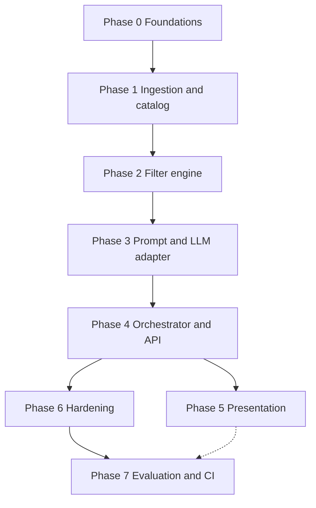

# Phase-wise implementation plan

This plan implements the system described in [problemStatement.md](./problemStatement.md) and [architecture.md](./architecture.md). Phases are ordered by **dependencies**: each phase produces artifacts the next phase can rely on. Exit criteria tie back to the problem statement **success criteria** and architecture **principles** (grounding, deterministic filters, testability).

---

## Document alignment

| Phase focus | Problem statement | Architecture |
|-------------|-------------------|--------------|
| Data | § Workflow “Data ingestion”, data source, licensing | §4.1 Ingestion, §4.2 Catalog, §5 canonical model, §8 config (pin revision, mapping) |
| Preferences & filter | § User input, hard constraints | §4.3 Filter engine, `CandidateSet`, empty state before LLM |
| LLM path | § Integration + recommendation engine | §4.4–4.6 Prompt, adapter, validator; §7 guardrails |
| UX | § Output display | §4.7 Client; sequence diagram §6 |
| Quality | § Success criteria, in-scope guardrails | §9 observability, §11 testing |

---

## Overview (phases at a glance)

| Phase | Name | Primary outcome |
|-------|------|-----------------|
| 0 | Foundations | Runnable repo, stack choices recorded, config skeleton |
| 1 | Ingestion & catalog | HF dataset → canonical `Restaurant` + stable IDs in a store |
| 2 | Filter engine | Deterministic `UserPreferences` → `CandidateSet` + tests |
| 3 | LLM integration | Prompt builder + adapter + structured parse (mockable) |
| 4 | Orchestration & API | Full pipeline, validator merge, HTTP or CLI contract |
| 5 | Presentation | UI or CLI: forms, cards, empty/error states |
| 6 | Hardening | Metrics, logging, injection caps, JSON retry, optional repair pass |
| 7 | Evaluation & shipping | Persona checks, CI tests without live LLM, container optional |

---

## Phase 0 — Foundations

**Goal:** Close enough of the [open decisions](./problemStatement.md#open-decisions-to-resolve-during-implementation) to start coding without rework.

**Activities**

- Pick **runtime** (e.g., Python + FastAPI, or Node; notebook-only is acceptable for Phase 1–2 if you defer HTTP to Phase 4).
- Pick **LLM provider** and document env var names (`LLM_API_KEY`, base URL, default model); do not commit secrets.
- Add **dependency management** (e.g., `pyproject.toml`, `requirements.txt`, or `package.json`) and a minimal **README** with how to run ingestion and tests.
- Create **`config/`** placeholders: dataset id + **pinned revision** (architecture §8), path for column mapping file, budget policy placeholder (filled in Phase 1 after profiling data).
- Optional: **ADR** or a short `docs/decisions.md` entry recording stack choice (architecture §13).

**Deliverables**

- Repo boots (install + one no-op or health command).
- `.env.example` listing required variables (no real keys).

**Exit criteria**

- A new contributor can install dependencies and see documented commands.
- Dataset revision and mapping file location are defined in config, even if mapping is initially empty pending dataset inspection.

---

## Phase 1 — Ingestion and catalog

**Goal:** Implement architecture [§4.1 Ingestion](./architecture.md#41-ingestion-pipeline) and [§4.2 Catalog service](./architecture.md#42-catalog-service); satisfy problem statement **grounding** prerequisite (all rows traceable to dataset).

**Activities**

- Load [ManikaSaini/zomato-restaurant-recommendation](https://huggingface.co/datasets/ManikaSaini/zomato-restaurant-recommendation) via Hugging Face or cache; honor **pinned revision** for repeatability (problem statement success: deterministic filtering given same snapshot).
- Inspect raw columns; author **`config/mapping.yaml`** (or JSON) from Hub columns → [canonical `Restaurant`](./architecture.md#5-canonical-data-model-conceptual) fields.
- Implement **normalize** (trim, parse numbers, split cuisines, null handling).
- Assign **`restaurant_id`** using a documented strategy (hash of key fields vs. deterministic sort + index); persist strategy in code comments or ADR.
- Implement **catalog store** (in-memory list or SQLite/Parquet per architecture §3): `get_restaurant_by_id`, `stream_all` (or equivalent).
- Emit **ingestion metrics**: row count, dropped rows, warnings (architecture §4.1 outputs, §9 metrics).

**Deliverables**

- Ingestion entrypoint: startup load, CLI `ingest`, or one-shot script.
- Unit tests: **golden-file** or fixture tests for raw row → canonical `Restaurant` (architecture §11).

**Exit criteria**

- Every loaded restaurant has a **stable `restaurant_id`** and mapped display fields (name, location, cuisines, rating, cost) where present in source data.
- Ingestion completes on a fresh machine with documented HF/cache behavior; licensing note remains in README or `docs/` per problem statement.

**Dependencies:** Phase 0.

---

## Phase 2 — Filter engine and candidate set

**Goal:** Deterministic **hard filters** and **candidate cap** per [architecture §4.3](./architecture.md#43-filter-engine); implement problem statement workflow steps “filter and prepare candidate set” **without** LLM.

**Activities**

- Define **`UserPreferences`** DTO matching API shape you plan to expose (location, `budget_band`, cuisines, `min_rating`, `free_text`, `top_k`).
- Implement **hard filters**: location match (document normalization: substring vs. allowlist), `min_rating`, cuisine any-of, budget band using **config** from Phase 0/1 (percentiles at ingest or fixed thresholds—document which).
- Decide **null rating** policy (exclude vs. include) and document it.
- Implement optional **soft pre-score** and **cap** (e.g., 30–80 candidates) with documented tie-breaking.
- Return **`CandidateSet`** including metadata: `total_after_hard_filters`, `capped_to` (for debug field in response later).

**Deliverables**

- Pure function or class method: `filter(preferences, restaurants) -> CandidateSet`.
- **Parametric unit tests**: boundaries, empty cuisines, unknown city, budget edges, nulls (architecture §11).

**Exit criteria**

- Same preferences + same catalog snapshot → **same candidate set** (order stable if you define sort before cap).
- Zero candidates yields a structured result **without** calling an LLM (architecture §4.7, sequence diagram alt branch).

**Dependencies:** Phase 1.

---

## Phase 3 — Prompt builder and LLM adapter (Groq)

**Goal:** [§4.4 Prompt builder](./architecture.md#44-prompt-builder) and [§4.5 LLM adapter](./architecture.md#45-llm-adapter); structured output contract for [§4.6 Validator](./architecture.md#46-response-validator-and-assembler) input.

**Provider:** **[Groq](https://console.groq.com/)** — OpenAI-compatible **Chat Completions** HTTP API (`/v1/chat/completions`). Keys and defaults live in `.env` / `config/app.toml` (see architecture §8).

**Activities**

- **System prompt**: only restaurants from provided list; no invented attributes; output **strict JSON** (or schema-enforced format) with `{ restaurant_id, rank, explanation }[]` and optional `summary`.
- **User message**: compact serialization of preferences + candidates; **token management** (truncate long fields, IDs for join) per architecture §4.4.
- **Groq LLM adapter**: `GROQ_API_KEY` (or transitional `LLM_API_KEY`), base URL, model id; timeout (30–60s); bounded retries on 429/5xx; return raw content plus **latency**; optional `response_format: json_object` when the model supports it.
- **Parsing**: strict JSON; on failure, surface structured error to orchestrator (architecture §4.5, §7 non-JSON handling).
- Unit tests: **mock HTTP** (no live Groq in default CI); structural tests on prompt builder; parse tests using **fixtures** (architecture §11).

**Deliverables**

- Interface e.g., `complete(messages) -> LLMResult` swappable for tests (Groq implementation behind it).
- Documented JSON schema for model output (`rankings` + optional `summary`).

**Exit criteria**

- With a **fixture** model response file, downstream validator can parse and join (dry run in tests).
- `free_text` length cap and delimiter policy documented (architecture §7 prompt injection).

**Dependencies:** Phase 2 (needs `Restaurant` + candidate list shape).

---

## Phase 4 — Orchestrator, validator, and API surface

**Goal:** Wire the [sequence in architecture §6](./architecture.md#6-end-to-end-sequence-recommend); expose **recommend** as HTTP API and/or CLI per Phase 0 choice.

**Activities**

- **Orchestrator** single entry: validate prefs → load catalog → filter → if empty return early → build prompt → LLM → **validate_and_merge**.
- **Validator**: parse picks; join to candidate map; drop unknown IDs; sort by `rank`; enforce “display fields from catalog only” for numeric facts (architecture §4.6, §7).
- Decide **backfill policy** (template explanations vs. fewer items + warning) and implement consistently.
- **API layer**: validate JSON body, stable error codes, map to `RecommendationResponse` (architecture §5) including optional `debug` (filter counts, model id) behind flag.
- Integration test: **orchestrator + mocked LLM** returns grounded items only.

**Deliverables**

- `POST /recommendations` (or equivalent CLI `recommend --json ...`).
- E2E-style test without live LLM using recorded response (architecture §11 E2E optional).

**Exit criteria**

- Meets problem statement **success criteria**: no invented venues in structured output; hard constraints reflected in candidates before LLM; explanations attached per item from model merge.
- Empty candidate path returns user-meaningful message and no LLM cost.

**Dependencies:** Phases 1–3.

---

## Phase 5 — Presentation (client)

**Goal:** Problem statement [§ Output display](./problemStatement.md#5-output-display); architecture [§4.7 Client](./architecture.md#47-client--presentation).

**Activities**

- **Input**: structured fields + optional free-text; client-side validation aligned with API.
- **Output**: cards with name, cuisines, rating, cost, AI explanation; optional summary line.
- **UX**: loading state during LLM; error toasts/messages for timeouts and invalid JSON; **empty state** when filters match nothing.
- If web: accessible forms and readable typography; if CLI: readable table or formatted blocks.

**Deliverables**

- Client talks only to your API (no direct HF/LLM keys in browser for production-style layout; keys stay server-side).

**Exit criteria**

- A non-developer can complete one full journey: enter prefs → see grounded recommendations or a clear empty/error state.

**Dependencies:** Phase 4.

---

## Phase 6 — Hardening and observability

**Goal:** [architecture §7](./architecture.md#7-grounding-safety-and-quality-guardrails), [§9](./architecture.md#9-observability-and-operations), and remaining guardrails from problem statement (in-scope).

**Activities**

- **Metrics**: `ingestion_rows`, `filter_pass_count`, `candidates_sent_to_llm`, `llm_latency_ms`, `llm_errors`, `validation_drops` (architecture §9).
- **Logging**: structured logs; redact API keys; truncate prompts outside dev.
- **JSON repair**: optional single retry prompt on parse failure (architecture §7).
- **Optional repair pass** for invalid restaurant IDs (architecture §7); cap at one retry.
- Rate limiting or max `free_text` length enforced at API.

**Deliverables**

- Observable runbook snippet in README (what to check when recommendations are empty or slow).

**Exit criteria**

- Failure modes (LLM down, parse error, timeout) return safe messages without leaking secrets.
- Debug payload can be disabled in production config.

**Dependencies:** Phase 4 (Phase 5 can proceed in parallel where UI does not block metrics).

---

## Phase 7 — Evaluation, CI, and optional packaging

**Goal:** Problem statement [in-scope evaluation](./problemStatement.md#scope-and-non-goals); repeatability and demo readiness.

**Activities**

- **Persona set**: 5–10 fixed preference profiles; manual or scripted checklist for explanation quality and constraint satisfaction (not automated LLM-judge required for MVP).
- **CI**: run unit tests without network or with cached data; **no live LLM** in default pipeline (fixtures only).
- Optional: **Dockerfile** per architecture §10; volume for HF cache.
- Update [problemStatement.md](./problemStatement.md) open decisions section with **resolved** stack, mapping notes, and budget policy.
- Update [architecture.md](./architecture.md) §13 with concrete service names and one deployment diagram if packaging added.

**Deliverables**

- CI config (e.g., GitHub Actions) green on main.
- Optional container build documented.

**Exit criteria**

- New clone passes CI with documented data/cache strategy.
- Docs reflect final decisions (closes loop with problem statement “update as implementation choices are made”).

**Dependencies:** Phases 1–6 (CI can start earlier with partial test suite).

---

## Dependency diagram

---

## What stays out of scope (all phases)

Per [problemStatement.md — Out of scope](./problemStatement.md#scope-and-non-goals): Zomato production APIs, payments, order tracking, training a custom embedding/ranker from scratch unless you explicitly add a future phase. Architecture [§12 Evolution](./architecture.md#12-evolution-path-out-of-scope-today-aligned-with-problem-statement) lists optional follow-ons (retrieval, learned ranker, A/B prompts).

---

## Suggested first milestone (MVP)

**Complete through Phase 5** with Phases 0–4 strictly done: a user can submit preferences and receive **grounded** recommendations with explanations. Treat Phase 6–7 as **production-ish** polish for a learning project demo or portfolio piece.

---

## Document map

| Document | Role |
|----------|------|
| [problemStatement.md](./problemStatement.md) | Goals, success criteria, scope |
| [architecture.md](./architecture.md) | Components, sequences, guardrails |
| **implementation-plan.md** (this file) | Ordered phases, deliverables, exit criteria |
| [edgecase.md](./edgecase.md) | Edge cases and failure modes by subsystem |
| [eval/phase-0.md](./eval/phase-0.md) … [eval/phase-7.md](./eval/phase-7.md) | Evaluation criteria per phase |

---

*Revise phase boundaries when stack choices land (e.g., if UI is embedded in a notebook-only demo, Phase 5 may shrink and Phase 4 may be CLI-first).*
